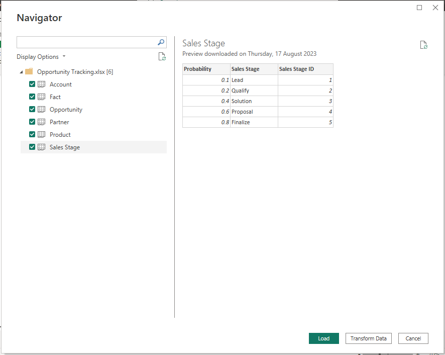
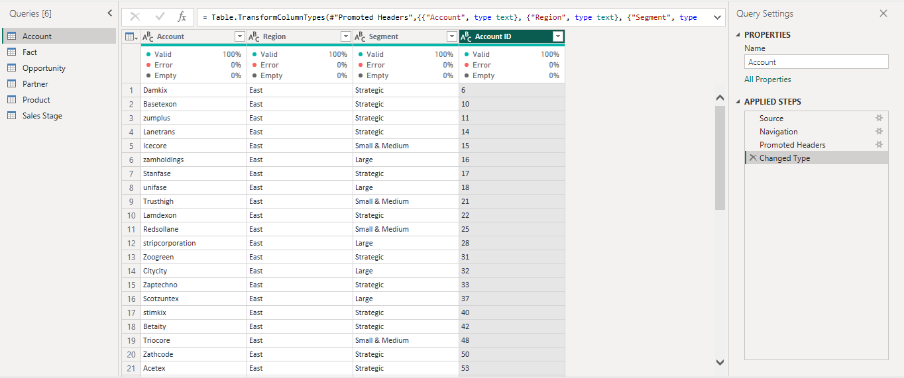
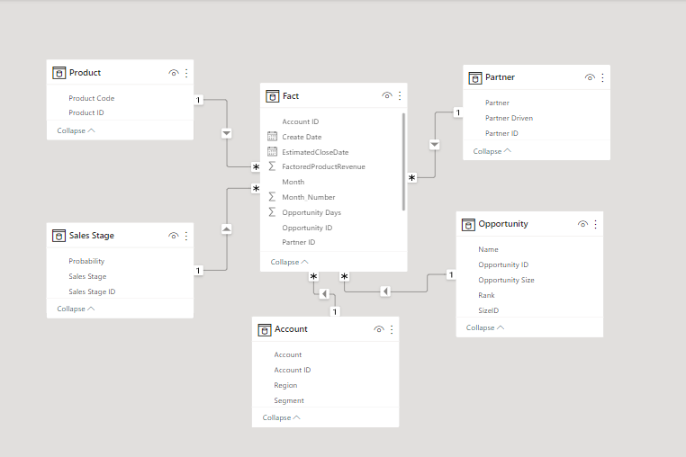
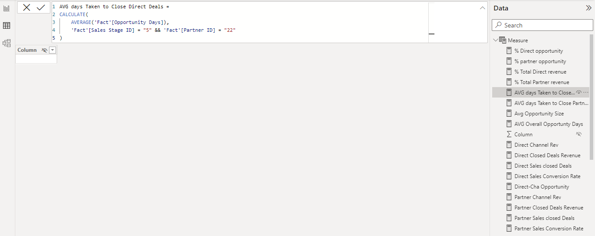
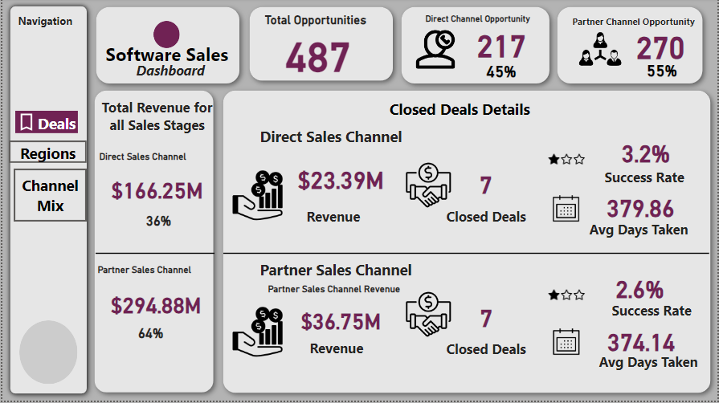
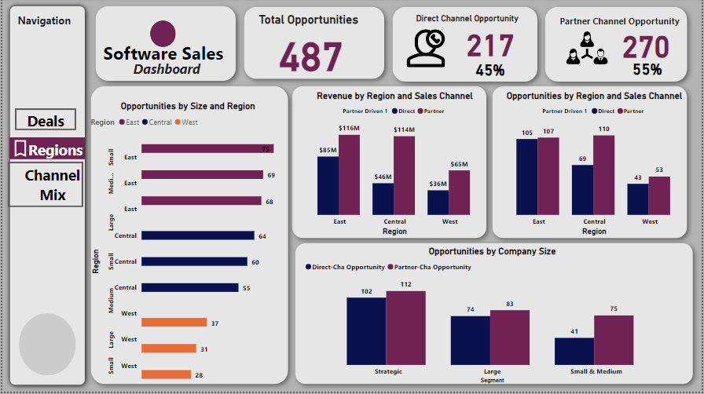
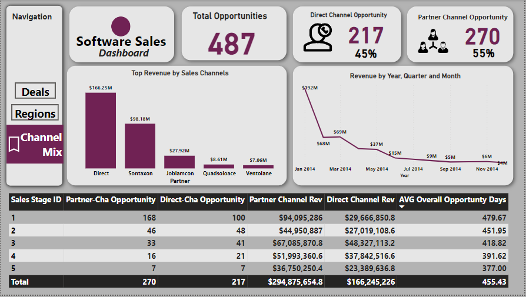

# Software-Sales-Report
This project gain insights into a software company's sales channels, with a focus on the direct and partner sales channels. The analysis provides actionable information to sales managers, enabling them to optimize sales strategies, resource allocation, and revenue generation.(The picture below is gotten from freepiks website)

## Introduction
This is an analysis of a software company’s sales channels. The analysis is done based on datasets given namely; Account table, fact table, Opportunity table, partner table, Product table and Sales Stage table.

The goal of this data analytics project is to optimize sales performance, enhance resource allocation, and maximize revenue generation through the direct and partner sales channels.
 

## Problem Statement
The analysis should answer the following questions: 
*	How does revenue compare between the direct and partner sales channels? 
*	Which channel contributes the most opportunities and revenue?
*	Are there specific regions where one channel outperforms the other? 
*	What are the regions that generate the highest revenue for each sales channel? 
*	Are there untapped regions with growth potential for specific channels? 
*	What are the conversion rates for opportunities to closed deals for each channel? 
*	Which channel has a higher success rate in converting opportunities? 
*	Are there significant variations in the sales cycle duration? 
*	Is there an optimal channel mix that leads to higher revenue overall? 
*	Which channels are complementary, and which ones might compete? 
*	Which partners are consistently driving the most revenue? 
*	Are there specific deal size and region combinations that show potential? 
*	How does customer segmentation (industry, company size) impact channel effectiveness? 
*	Are there seasonal patterns in opportunity creation and revenue generation for each channel? 
*	How can the company align sales efforts with these trends

## Data Source
The data used for this work is gotten from Dahel Consultants and Techies for Power BI Challenge. It was the dataset provided to everyone who participate in the challenge. I'm happy to inform you that I WON! You can confirm from this [LinkedinPost.](https://www.linkedin.com/posts/modinatganiyudataanalyst_powerbichampion-grateful-dataanalysis-activity-7111456548857536512-Hd-_?utm_source=share&utm_medium=member_desktop) I studied the dataset, data dictionary and found the right parameters for the analysis.

## Skills and Concepts Demonstrated
Power BI concepts like:
*	Created key performance indicators (KPIs) and other business calculations
*	Developed general DAX calculations, performed advanced DAX calculations for solving statistical measures and other mathematical formulas
*	Understanding of Business Requirements
*	Performance Optimization
*	Page buttons
*	Data Visualization

## Data Transformation
I imported the file into Power BI then selected all tables and clicked on Transform Data

### Data Cleaning
I tranformed the data in Power Query, checked for Colum quality and converted each column to it appropriate data type.
* Power Query

I closed and apply after all necessary changes

### Data Modelling
The Star Schema is the 'Fact Table' and other 5 tables were connected to it. PowerBI does this intelligently, automatically creating relationships with them.
* Model View

## Data Analysis 
I began writing several DAX, creating advance measures and calculated columns to get the right metrics for the Software Company's Sales analysis. Several expressions and functions were made to arrive at the desired Key Performance Indicator (KPI). Translated business requirements into report specifications and optimized the report performance by considering the data volume and using best practices. 
* DAX

## Data Visualization
Effective and meaningful visualizations were created using charts, tables and other Power BI visuals. Organizing and arranging visuals were put to play in designing the dashboards for a cohesive view of key performance indicators.
I arrived at a report with three (3) pages named:
* Deals
* Regions
* Channel Mix

### First Page
The first page is named Deals and it contains all information in regards to closed and nonclosed deals with a focus on direct and partner sales channel. The page has a Page Navigation button by the left side. The button is also on other pages for easy access to any page. This page shows the total number of opportunities created, revenue generated, average days to close a deal and so on.
* Deals
 

The second page shows all the details by region in regards to number of opportunities, revenue and opportunity size by both sales channels.
* Region

The third page shows top revenue of partners, revenue trend by year and explains the optimal channel mix that will lead to higher revenue overall.
* Channel Mix

  
You can interact with the file 

## Analysis
* The overall opportunities and revenue generated by partner sales channel is greater than direct sales channel including closed deal details.
* East region outperforms other regions across all opportunity size(small, medium and large)
* Among the 3 regions, East region generate the highest revenue for both direct and partner sales channels.
* Partner Channel has a higher success rate in converting opportunities to closed deals
* Sontaxon organization consistently drive the most revenue among all partners throughout the Year
* There are seasonal patterns in opportunity creation and revenue generation for each channel
  
## Recommendation
* In Central region, the revenue generated by both channels are miles apart. Partner channel is doing great in regards to generating high revenue while direct channel is yet to tap the opportunities in this region. So, the company should put more efforts to maximize their growth potentials in this region.
* To optimize channel mix that will lead to higher revenue overall, the company should fast track opportunities from first sales stage to the last sales stage to quickly convert potential customers to paying customers.
* Result shows that customers are willing to pay at the begining of the year so, company should align sales efforts with the period to increase sales.

## Thank you for reading!
I am open for data roles.

Let us have discussion about your company and industry now!
